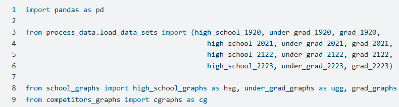
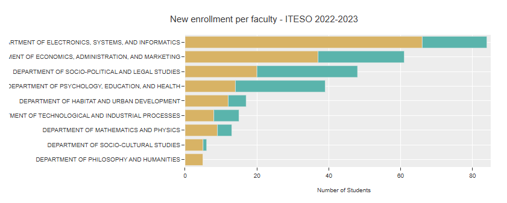
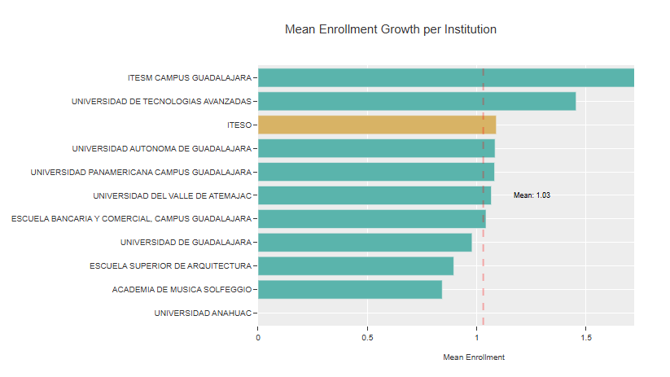
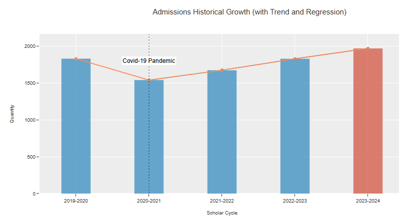

# EY Data Challenge: PE Investment Opportunity: ITESO Acquisition

This repository contains a collection of Python functions and Jupyter Notebook demonstrations for analyzing and visualizing ITESO's educational data. The project focuses on understanding ITESO's profile and market position by examining key metrics such as student enrollment, cost of attendance, and growth trends across multiple academic cycles. The insights derived from this analysis serve as a basis for evaluating ITESO's competitiveness in the education market and its potential as a strong commercial investment.

## Features
### Data Cleaning & Querying:
Scripts to clean and prepare raw data from various academic cycles, thta can be found in modular functions that can be easily integrated into Jupyter Notebooks for further exploration and custom analysis, enabling deeper analysis of ITESO's performance.

### Interactive Visualizations:
Functions to generate interactive graphs using Plotly, including:

* Bar charts (grouped and stacked)
* Treemaps
* Line charts with regression predictions
These visualizations illustrate trends in student enrollment, cost breakdowns, and growth rates.

### Comparative Analysis:
Tools to compare ITESO against competitor institutions based on key metrics like tuition costs, enrollment capture, and growth percentages.

### Predictive Modeling:
Simple linear regression models to forecast future trends, such as predicted enrollment numbers for upcoming academic cycles.

## Usage
Clone the Repository:

        git clone https://github.com/manuelsolan-o/DataChallengeEY.git
